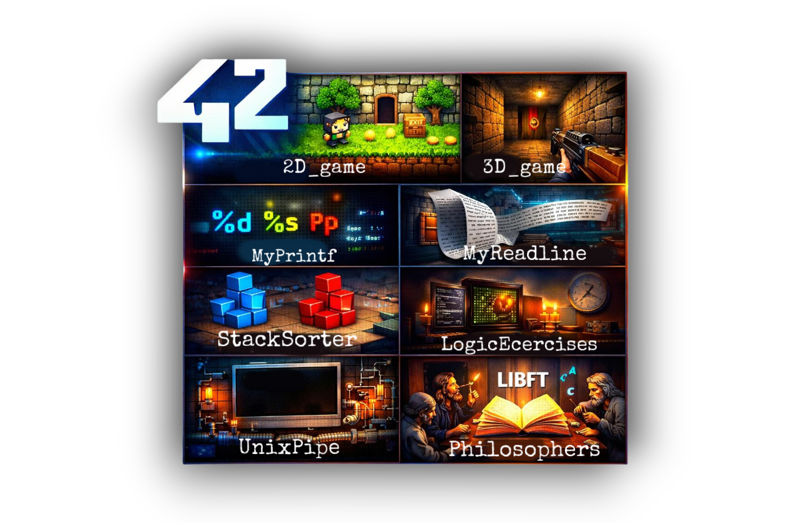

# C-playground

Collection of C projects i have built during my 42-common-core (games, libs, and utilities).

  
  <!--  -->
  <!--  -->

## Contents

- Games
  - 2D: so_long — [2D-game/Makefile](2D-game/Makefile), [2D-game/so_long.h](2D-game/so_long.h), sample [2D-game/map.ber](2D-game/map.ber)
  - 3D: cub3D — [3D-game/Makefile](3D-game/Makefile), [3D-game/include/cub3d.h](3D-game/include/cub3d.h), sample [3D-game/map.cub](3D-game/map.cub)
- Concurrency
  - Dining Philosophers — [DiningPhilosophers/philo/Makefile](DiningPhilosophers/philo/Makefile)
- Libraries
  - Libft — [LibC/Makefile](LibC/Makefile), headers [LibC/libft.h](LibC/libft.h)
  - Printf — [MyPrintf/Makefile](MyPrintf/Makefile)
- Algorithms
  - Stack sorter (push_swap) — [StackSorter/Makefile](StackSorter/Makefile), utils [StackSorter/utils/utils.h](StackSorter/utils/utils.h)
  - Unix pipe (pipex) — [UnixPipe/Makefile](UnixPipe/Makefile)
- Logic exercises with statements and solutions — [LogicExercises/README.md](LogicExercises/README.md)

## Project Summaries

- 2D-game (so_long):
  A simple 2D tile-based game built with MinilibX.
  Parses `.ber` maps, validates paths, renders sprites, and lets the player collect items to reach the exit.

- 3D-game (cub3D):
  A ray-casting engine inspired by Wolfenstein 3D using MLX42/GLFW.
  Parses `.cub` maps and textures, casts rays to render walls, and supports player movement and rotation.

- DiningPhilosophers:
  Concurrency exercise simulating philosophers eating and thinking with threads and mutexes.
  Focuses on deadlock avoidance, timing accuracy, and synchronized, thread-safe logging.

- LibC (libft):
  A custom standard C library reimplementation.
  Provides string, memory, and linked-list utilities compiled into `libft.a`.

- MyPrintf:
  A minimal `printf` implementation supporting common format specifiers.
  Handles characters, strings, integers, hex, pointers, and `%`; built as `libftprintf.a`.

- StackSorter (push_swap):
  Sorts integers using two stacks and a constrained set of operations.
  Implements move generation, cost evaluation, and optimized strategies to minimize operations.

- UnixPipe (pipex):
  Recreates shell piping between commands with input/output redirections.
  Manages `fork/exec`, file descriptors, and pipes across chained commands.

- LogicExercises:
  Bite-sized C problems emphasizing core logic and fundamentals.
  Each exercise is standalone with a clear statement and a minimal solution.

## Build

Each subproject has its own Makefile. Typical flow:

- **so_long:**
  - macOS + MinilibX required.
  - **Build**: `cd 2D-game && make`
  - Run: ./so_long map.ber
- **cub3D**:
  - Requires MLX42 and GLFW. Adjust library paths in [3D-game/Makefile](3D-game/Makefile) (see -L"/Users/$(USER)/homebrew/Cellar/glfw/...").
  - **Build**: `cd 3D-game && make`
  - Run: ./cub3D map.cub
- **Dining Philosophers**:
  - **Build**: `cd DiningPhilosophers/philo && make`
- **Libft**:
  - **Build**: `cd LibC && make (produces libft.a)`
- **Printf**:
  - **Build**: `cd MyPrintf && make (produces libftprintf.a)`
- **StackSorter** (push_swap):
  - **Build**: `cd StackSorter && make`
- **UnixPipe** (pipex):
  - **Build**: `cd UnixPipe && make`
- **LogicExercises**:
  - Each exercise is standalone; compile the corresponding .c as needed.

Clean/rebuild targets are available (clean, fclean, re) where provided.

## Requirements

- GCC/Clang toolchain and make.
- macOS dependencies:
  - **2D-game** uses MinilibX: OpenGL + AppKit frameworks (see [2D-game/Makefile](2D-game/Makefile)).
  - **3D-game** uses MLX42 + GLFW (install via Homebrew and update the path in [3D-game/Makefile](3D-game/Makefile)).

## Contributing

See [CONTROBUTION.md](CONTROBUTION.md).

## License

MIT — see [LICENSE](LICENSE).